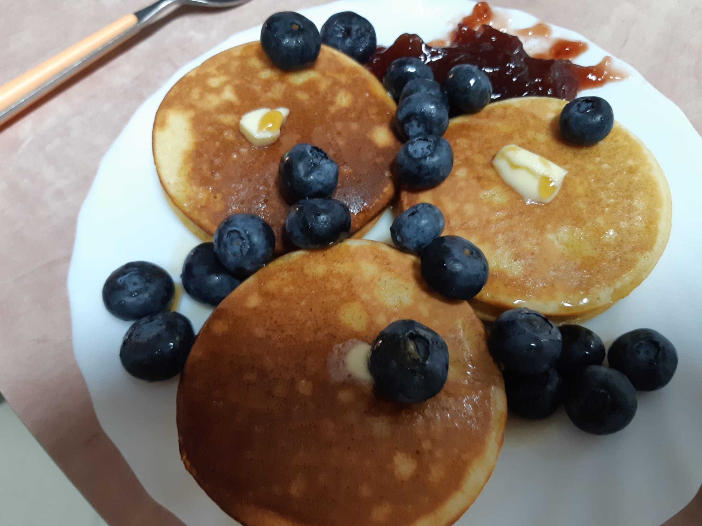
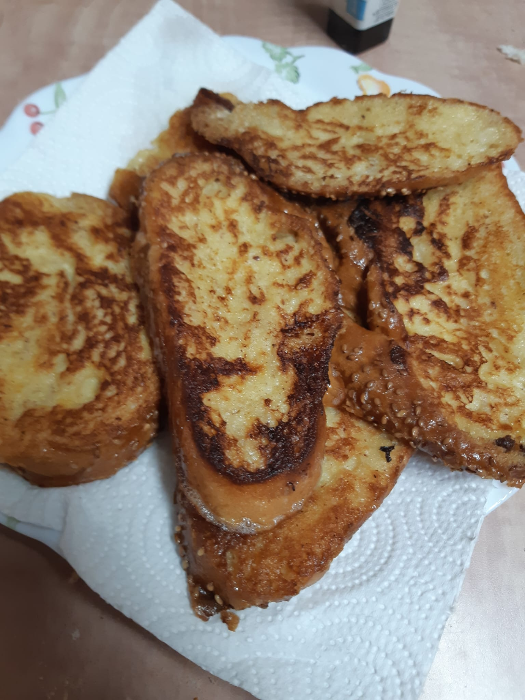
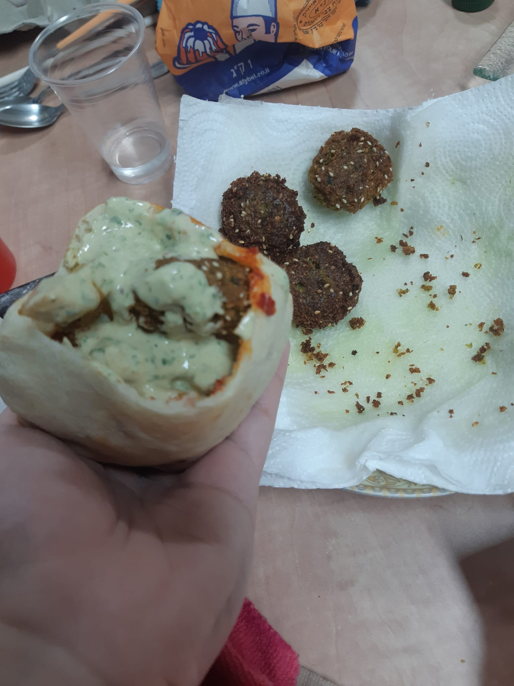

# Multimodal Recipe Extractor
### B.Sc Deep Learning Course Project
## Overview
This project was developed as part of a B.Sc. Deep Learning course. It implements a multimodal system that combines computer vision and large language models to recognize food from an input image and generate an appropriate recipe.

The system consists of two main stages:
1. Food Recognition – A fine-tuned ResNet-50 convolutional neural network (CNN) analyzes an input image and predicts the top 3 most likely food classes.
2. Recipe Generation – The top 3 predictions are provided as context to a LLaMA 2 7B language model, which generates a recipe corresponding to the identified food.

## Dataset
The image classification component was trained using the Food-101 dataset, which contains images belonging to 101 different food categories.

The project also uses a recipe dataset containing information such as food/recipe labels, ingredients and the recipe instructions.

## Models
### ResNet-50
A pretrained ResNet-50 model was used as the base image classification model. The model was adapted and fine-tuned for the Food-101 classification task.
The image classifier produces a probability distribution over the food classes, from which the three highest-probability predictions are selected.

### LLaMA 2 7B
The top 3 predictions from the image classifier are passed to a LLaMA 2 7B language model. The model uses these predictions to generate a suitable recipe.
Additional example recipes are included in the prompt to provide the model with additional context and encourage creative while reasonable recipe generation.

## Project Notebook
The main project notebook (.ipynb) contains the complete development and experimentation process.

Important: The notebook is intentionally structured to document our work process, rather than being presented as a clean, production-ready implementation.
As required by the course submission guidelines, the notebook demonstrates the different stages of development, experimentation, model training, evaluation, and testing. As a result, it may contain:

* Repeated or redundant code
* Multiple versions of experiments
* Intermediate results
* Training attempts and evaluations
* Code that was later replaced or modified
* Explanations of decisions made throughout the development process

Some cells may therefore appear unnecessary when viewed purely as a final implementation. They are included intentionally to provide a transparent record of our development process and to demonstrate the reasoning and experimentation behind the final system.

## Technologies
* Python
* PyTorch
* Torchvision
* ResNet-50
* LLaMA 2 7B
* Hugging Face Transformers
* Food-101
* Jupyter Notebook / Google Colab

## Project Structure
```text
.
├── README.md
└── DLProjectMRE.ipynb
```
The main `.ipynb` notebook contains the implementation, experiments, training procedures, evaluation, and final demonstration.

## Results
The ResNet-50 classifier achieved the following results on the Food-101 classification task:
| Metric | Result |
|---|---:|
| Top-1 Accuracy | 74.52 % |
| Top-3 Accuracy | 87.75 % |
| Precision | 74.62 % |
| Recall | 74.52 % |
| F1 Score | 74.44 % |

The top-3 classification approach was used because providing multiple candidate food classes to the language model allows the recipe-generation stage to make use of the classifier's highest-confidence predictions.

## Examples
<p align="center">
  
</p>

**Top-3 Predictions:**
pancakes, creme_brulee, cheesecake

### Generated Recipe
```
Ingredients:
- 2 eggs
- 2 c. flour
- 1 1/2 c. milk
- 3 tbsp. sugar
- 1 1/2 tbsp. baking powder
- 2 tbsp. canola oil or veggie oil

Steps:
- beat eggs until fluffy in medium size mixing bowls.
- add flour
- sugar
- baking powder
- milk and oil.
- mix until well blended.
- fry in large skillet
- lightly oiled.
```

<p align="center">
  
</p>

**Top-3 Predictions:**
french_toast, garlic_bread, onion_rings

### Generated Recipe
```
Ingredients:
- Eggs
- Milk
- Butter
- Salt
- Pepper

Steps:
- Beat eggs and milk together in a bowl.
- Add butter and salt and pepper to taste.
- Pour mixture over bread slices.
- Bake at 350 degrees Fahrenheit until golden brown.
```
<p align="center">
  
</p>

**Top-3 Predictions:**
falafel, hummus, carrot_cake

### Generated Recipe
```
Ingredients:
- tahini-yogurt sauce:
- 1/3 cup plain low-fat yogurt
- 2 tablespoons tahini (roasted sesame seed paste)
- 2 tablespoons cold water
- 1 tablespoon fresh lemon juice
- 1/4 teaspoon salt
- 1/4 teaspoon freshly ground black pepper
- falafel:
- 1 1/3 cups boiling water
- 2/3 cup uncooked bulgur
- 2 garlic cloves
- 1/3 cup fresh parsley leaves
- 1/4 cup fresh cilantro leaves
- 3/4 teaspoon ground cumin
- 1/4 teaspoon salt
- 1/4 teaspoon ground red pepper
- 1 (15-ounce) can chickpeas (garbanzo beans)
- rinsed and drained
- 1 large egg white
- 3 tablespoons olive oil
- divided
- 2 (6-inch) whole-wheat pitas
- halved crosswise
- 1 cup chopped tomato (1 medium tomato)
- 1/2 cup thinly sliced english cucumber
- 1/3 cup thinly sliced red onion
Steps:
- to prepare tahini-yogurt sauce
- combine first 6 ingredients in a small bowl. cover and chill until ready to serve.
- to prepare falafel
- combine 1 1/3 cups boiling water and bulgur in a small bowl. cover and let stand 25 to 30 minutes or until tender. drain.
- drop garlic through food chute with processor on; process until minced. add bulgur
- parsley
- and next 6 ingredients (through egg white); process until smooth. divide mixture into 8 equal portions
- shaping each into a 1/2-inch-thick patty. place patties on a baking sheet; cover and chill 30 minutes.
- heat 1 1/2 tablespoons oil in a large nonstick skillet over medium-high heat. add 4 patties; cook 3 minutes on each side or until golden brown. repeat procedure with remaining 1 1/2 tablespoons oil and 4 patties.
- spread 1 tablespoon tahini-yogurt sauce inside each pita. fill each pita half with 2 patties. divide tomato
- cucumber
- and red onion evenly among pita halves
- and drizzle evenly with 1 tablespoon sauce.
```

## LLM Assistance
Note: ChatGPT was used as a development aid for portions of the code, including code generation and debugging. All generated code was reviewed and adapted by the authors.

## Authors
Lidor Lutati - lidor37@gmail.com - [GitHub: LL37477](https://github.com/LL37477)
Haim Bortman - bortman.haim@gmail.com - [GitHub: hb9111](https://github.com/hb9111)
